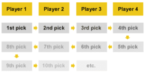
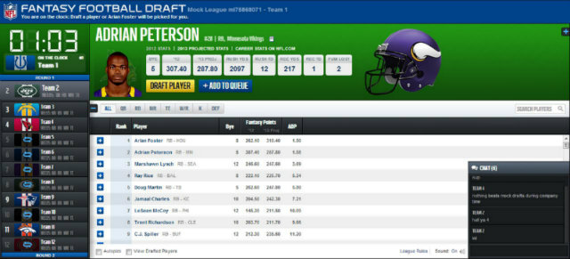

```{r setup, include=FALSE}
knitr::opts_chunk$set(echo = FALSE)
```

## What is fantasy football?

- Draft a team of real football players
- Set a weekly lineup and earn points based on their statistical performance
- Teams compete head-to-head each week to compile season records, compete in playoffs, and win the championship
- Note: real football skill $\neq$ fantasy football skill
- Betting
- I'm not covering DFS


## Draft types

- Snake vs Auction
- Different strategy, greater volume and velocity of decisions




## A reasonable draft strategy

- Draft a team that optimizes _starting lineup_ expected points per game
- Other draft strategies employ game theory to buck convention, or better account for injury risk, or take other factors into account (e.g. dynasty leagues)
- To _optimize_ a lineup, one needs _data_ over which to optimize

## ffanalytics package

- Used to crowdsource data and compile projections
- Scrapes a dozen websites and applies a weighted average based on past accuracies
- Accommodates for custom scoring schemes


<a href="https://fantasyfootballanalytics.net/" style = "font-size: 12pt; display: table; margin: 0 auto;">https://fantasyfootballanalytics.net</a>

## Optimization primer

Here's an example.

$$\begin{equation*}
\begin{aligned}
& \underset{x}{\text{minimize}}
& & f_0(x) \\
& \text{subject to}
& & f_i(x) \leq b_i, \; i = 1, \ldots, m.
\end{aligned}
\end{equation*}$$

## Linear programming

Differentiable and easier to address with e.g., gradient descent.

$$\begin{equation*}
\begin{aligned}
& \underset{x}{\text{minimize}}
& & y \\
& \text{subject to}
& & y \geq 5 - x \\
& & & y \geq x - 0.5
\end{aligned}
\end{equation*}$$

```{r include=FALSE}
library(ggplot2)
library(tidyverse)
v <- c(1, 1, 2, 2, 2, 2)
x <- c(0, 5, .5, 5, 5, 5)
y <- c(5, 0, 0, 4.5, 4.5, 4.5)
df1 <- data_frame(v, x, y)
```

```{r, echo = FALSE, fig.height=3}
ggplot(df1, aes(x = x, y = y, group = v)) + geom_line()
```

## Integer programming

Much harder optimization. (NP-complete)

$$\begin{equation*}
\begin{aligned}
& \underset{x}{\text{minimize}}
& & y \\
& \text{subject to}
& & y \geq 5 - x \\
& & & y \geq x - 0.5 \\
& & & x \in \mathbb{Z}
\end{aligned}
\end{equation*}$$

```{r include=FALSE}
x2 <- 0:5
y2 <- c(5, 4, 3, 2.5, 3.5, 4.5)
df1$x2 <- x2
```

```{r, echo = FALSE, fig.height=3}
ggplot(df1) + geom_line(aes(x = x, y = y, group = v), col = "grey") + geom_point(aes(x = x2, y = y2))
```

## Optimizing a fantasy lineup {.build .smaller}

How would we formulate this problem?

$$\begin{equation*}
\begin{aligned}
& \underset{\mathbf{x}}{\text{maximize}} & & \mathbf{p^Tx} \\
& \text{subject to} & & \mathbf{c^Tx} \leq B \\
& & & \mathbf{{i_{QB}}^Tx} \leq QB_{max} \\
& & & \mathbf{{i_{RB}}^Tx} \leq RB_{max} \\
& & & \mathbf{{i_{WR}}^Tx} \leq WR_{max} \\
& & & \mathbf{{i_{TE}}^Tx} \leq TE_{max} \\
& & & \mathbf{{i_{FLEX}}^Tx} \leq FLEX_{max} \\
& & & x \in \{0, 1\}
\end{aligned}
\end{equation*}$$

where $\mathbf{p}$ is the estimated point total per player,
$\mathbf{c}$ is the estimated cost per player,
$B$ is the total budget available for the starting lineup,
each $\mathbf{i_{position}}$ is an indicator of whether each player is in a given position,
and $\mathbf{x}$ is a vector indicating whether the player is in the lineup (our search space).

## Optimal roster: just the starting point

Knowing the "dream team" is a good basis, but doesn't account for cost uncertainty and thus doesn't address each decision being made.

What if a good (but not "dream team") player is being bid on at a value much lower than his AAV (which is what is used in computing the "dream team")?

Since one cannot control for which players are put up when (nor for the actual value that each player will command), how should we restate the problem?

## Given a player, how much should I bid? {.build .smaller}

How would we formulate this problem?

$$\begin{equation*}
\begin{aligned}
& \underset{\mathbf{x}}{\text{maximize}} & & \mathbf{B - c^Tx} \\
& \text{subject to} & & \mathbf{p^Tx} \geq P_{dream} \\
& & & \mathbf{{i_{QB}}^Tx} \leq QB_{max} \\
& & & \mathbf{{i_{RB}}^Tx} \leq RB_{max} \\
& & & \mathbf{{i_{WR}}^Tx} \leq WR_{max} \\
& & & \mathbf{{i_{TE}}^Tx} \leq TE_{max} \\
& & & \mathbf{{i_{FLEX}}^Tx} \leq FLEX_{max} \\
& & & \mathbf{{x_{player}}} = 1 \\
& & & \mathbf{{c_{player}}} = 0 \\
& & & x \in \{0, 1\}
\end{aligned}
\end{equation*}$$

where $\mathbf{p}$ is the estimated point total per player,
$B$ is the total budget available for the starting lineup,
$\mathbf{c}$ is the estimated cost per player,
$P_{dream}$ is the estimated point total of the "dream team" starting lineup,
each $\mathbf{i_{position}}$ is an indicator of whether each player is in a given position,
and $\mathbf{x}$ is a vector indicating whether the player is in the lineup (our search space).

## Shiny tool: decision support

- Reactive elements
    - Player name selection runs bid-up-to optimization
    - All optimizations are reactive on constraints: positions, budget
    - AAV discount factor can update scores based on remaining funds in the league.
- Decision support elements
    - Dashboard displays all players and their AAV, along with availability
    - Longitudinal plot helps track how "hot" the draft is
    - Calculated values exposed "under the hood" for assurance
- Demo

## Future directions

- Refactoring and publishing on GitHub
    - 'Tidy' up the code and improve data structures
    - Improve I/O and some UI features
    - WIP: https://github.com/jasonmhoule/footapp
- Predictive modeling: even with bid-up-to, we still assume all other values are fixed
    - Better predict cost based on AAV, draft order (by position), PRK, etc.
    - Monte Carlo methods to better incorporate cost and point uncertainty

## Thank You

jasonmhoule@gmail.com

https://github.com/jasonmhoule/footapp